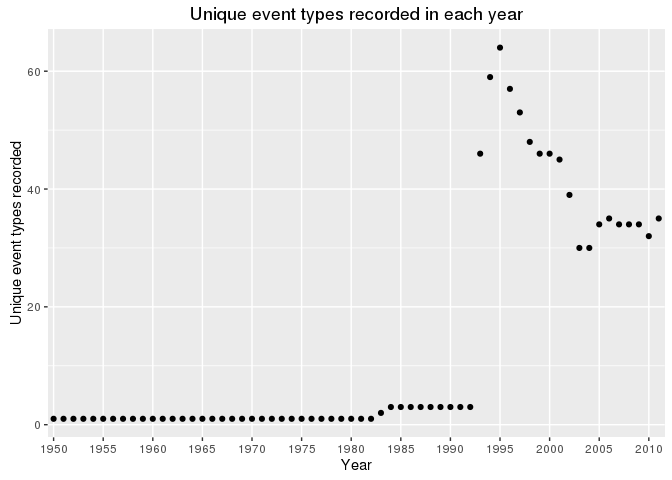
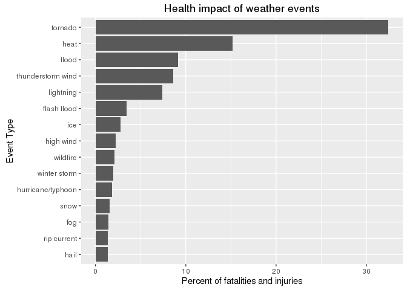
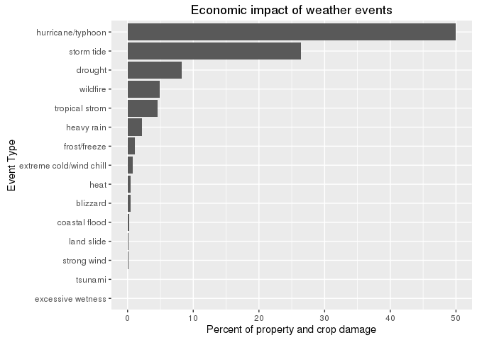

# Reproducible Research: Impact of Weather Events on population health and the economy
Marc T. Henry de Frahan  
# Synopsis

In this report, we analyze storm data from NOAA to determine the
weather events most detrimental to population health and the
economy. Measuring fatalities and injuries from various weather
events, we determined that tornados, heat, and floods are, in
decreasing order, the most damaging to population health. Crop and
property damage assessments were used to determine that the top three
events most harmful to the economy are hurricane/typhoons, storm
tides, and drought.

The full version history of this project can be found at my
[GitHub page](https://github.com/marchdf/RepData_PeerAssessment2).

# Load some libraries

```r
library(stringr)
library(dplyr)
```

```
## 
## Attaching package: 'dplyr'
```

```
## The following objects are masked from 'package:stats':
## 
##     filter, lag
```

```
## The following object is masked from '.startup':
## 
##     n
```

```
## The following objects are masked from 'package:base':
## 
##     intersect, setdiff, setequal, union
```

```r
library(lubridate)
library(ggplot2)
library(DataCombine)
```

## Download the data

Download the data and extract it only if it has not been done yet.

Setup some directory, file, and url names 

```r
datadir <- "./data"
tarname <- paste(datadir,"/stormdata.csv.bz2",sep='')
furl    <- "https://d396qusza40orc.cloudfront.net/repdata%2Fdata%2FStormData.csv.bz2"
```

Create data directory and download the tar file and load the data (if
it hasn't been done already)

```r
dir.create(datadir, showWarnings = FALSE)

## Download data if necessary
if (!file.exists(tarname)) {
    download.file(furl,tarname)
}

## Load the data if it hasn't been loaded yet
if(!exists("dataf")) {
    dataf <- read.csv(tarname)
}
```

# Data Processing

Let's only keep the columns that will be usefull

```r
keep <- c("BGN_DATE","BGN_TIME","EVTYPE","FATALITIES","INJURIES","PROPDMG","PROPDMGEXP","CROPDMG","CROPDMGEXP")
df <- dataf[keep]
```

Let's remove all the data which has no fatalities, injuries, property
damage, and crop damage.

```r
df <- df %>%
    filter(FATALITIES > 0 | INJURIES > 0 | PROPDMG > 0 | CROPDMG > 0) %>%
    droplevels()
dfrows <- nrow(df)
```
We just removed 71.78% of the
data (events which had no health or economic damage).

Now, let's remove the data which doesn't have a valid exponent and add
columns corresponding to the numeric value of the letter symbol
exponent (H=100, K=1000, M=1000000, B=1000000000). We create two new
columns where we combine the values and exponents of the crop and
property damage.

```r
## Make it the exponent letters uppercase (for consistency)
df <- df %>%
    mutate_each( funs(toupper),PROPDMGEXP,CROPDMGEXP) %>%
    mutate_each( funs(as.character),PROPDMGEXP,CROPDMGEXP) %>%
    droplevels()

## This lookup table makes the correspondance between letters and numbers
lookup_exp <- data.frame(c("","H","K","M","B"),
                         numeric.value=c(1,100,1000,1000000,1000000000))

## Change the column names and join with the two for the crops
colnames(lookup_exp) <- c("CROPDMGEXP", "CROPEXPVALUE")
df <- left_join(df,lookup_exp,by="CROPDMGEXP")
```

```
## Warning in left_join_impl(x, y, by$x, by$y): joining factor and character
## vector, coercing into character vector
```

```r
## Change the column names and join with the two for the property
colnames(lookup_exp) <- c("PROPDMGEXP", "PROPEXPVALUE")
df <- left_join(df,lookup_exp,by="PROPDMGEXP")
```

```
## Warning in left_join_impl(x, y, by$x, by$y): joining factor and character
## vector, coercing into character vector
```

```r
## Change the name again just to make things clean
colnames(lookup_exp) <- c("valid_exp", "numeric.value")

## Now create new columns which contain the full numeric value of the
## damage done (P/CROPDMG*P/CROPEXPVALUE)
df <- df %>%
    mutate(NUMERIC.PROPDMG = PROPDMG*PROPEXPVALUE,
           NUMERIC.CROPDMG = CROPDMG*CROPEXPVALUE)
```


Format the event types and drop those that look like mistakes

- make the events all lower case
- drop the "?" event type
- drop the "apache county" event type


```r
df <- df %>%
    mutate(EVTYPE = as.factor(tolower(df$EVTYPE))) %>%
    filter(!grepl('\\?|apache county', EVTYPE)) %>%
    droplevels()
```

Our next step will be to replace some of the event strings that have
typos and are generally inconsistent with the 48 categories specified
in the documentation for the data. After all the formating we have
done so far, we are left with 445
unformatted event types in our data. We need to devise a strategy to
sort those unformatted event types into the 48 established NOAA
weather event categories. We will adopt the following strategy, for
each type of damage (fatality, injury, property damage or crop
damage):

1. Identify the top 10 event categories that contribute to this type of damage.
2. For each of these categories, check the total list of events and identify possible duplicates/abbreviations/typos that fit a top 10 category.
3. Identify the substring that will allow us to replace this unformatted category with the established one.
4. Repeat 1-2-3 until the top 10 contributing categories don't change.

This procedure results in the following string substitutions that will
transform the list of unformatted categories into established NOAA
categories.

```r
original <- c(".*torn.*", ".*tstm.*", ".*thunderstorm.*", ".*thuderstorm winds.*", ".*thundeerstorm winds.*", ".*thunderestorm winds.*", ".*thunderstrom wind.*", ".*thundertorm winds.*", ".*thunerstorm winds.*", ".*tunderstorm wind.*", ".*coastal flooding.*", ".*coastal flooding/erosion.*", ".*tidal flooding.*", ".*flooding.*", ".*river flood.*", ".*flood & heavy rain.*", ".*flood/rain/winds.*", ".*flood/river flood.*", ".*floods.*", ".*major flood.*", ".*river and stream flood.*", ".*rural flood.*", ".*small stream flood.*", ".*urban.*", ".*lake flood.*", ".*flash.*", ".*heat.*", ".*lightning.*", ".*ice.*", ".*hail.*", ".*hurricane.*", ".*typhoon.*", ".*winter storm.*", ".*rip.*", ".*avala.*", ".*blizzard.*", ".*tropical.*", ".*wild.*", ".*surge.*", ".*land.*", ".*heavy rain.*", ".*strong wind.*", ".*extreme.*", ".*frost.*", ".*freeze.*", ".*high wind.*", ".*snow.*", ".*fog.*", ".*surf.*")
replacement <- c("tornado", "thunderstorm wind", "thunderstorm wind", "thunderstorm wind", "thunderstorm wind", "thunderstorm wind", "thunderstorm wind", "thunderstorm wind", "thunderstorm wind", "thunderstorm wind", "coastal flood", "coastal flood", "coastal flood", "flood", "flood", "flood", "flood", "flood", "flood", "flood", "flood", "flood", "flood", "flood", "lakeshore flood", "flash flood", "heat", "lightning", "ice", "hail", "hurricane/typhoon", "hurricane/typhoon", "winter storm", "rip current", "avalanche", "blizzard", "tropical strom", "wildfire", "storm tide", "land slide", "heavy rain", "strong wind", "extreme cold/wind chill", "frost/freeze", "frost/freeze", "high wind","snow","fog","high surf")
replace_types <- data.frame(from=original, to = replacement)

# Replace the strings
df <- FindReplace(data = df, Var = "EVTYPE", replaceData = replace_types, from = "from", to = "to", exact = FALSE)
```

Let's also add a year factor to the data so we can look at the event
types by year later on.

```r
df <- df %>%
    mutate(BGN_DATE=  mdy_hms(as.character(BGN_DATE))) %>%
    mutate(year= as.factor(year(BGN_DATE)))
```

Now we have a data frame where the event types have been cleaned such
that we can rely on the data for the top 15 event types that
contribute to the four types of damage we are interested in. We can
check that these categories account for most of the damage in each
damage category.

```r
sumdf <- df %>%
    mutate(EVTYPE = as.factor(EVTYPE)) %>%
    group_by(EVTYPE) %>%
    summarize(num.injuries   = sum(INJURIES),
              num.fatalities = sum(FATALITIES),
              num.health     = sum(INJURIES+FATALITIES),
              num.propdmg    = sum(NUMERIC.PROPDMG),
              num.cropdmg    = sum(NUMERIC.CROPDMG),
              num.econ       = sum(NUMERIC.PROPDMG+NUMERIC.CROPDMG)) %>%
    mutate(percent.injuries   = num.injuries/sum(num.injuries,na.rm=TRUE)*100,
           percent.fatalities = num.fatalities/sum(num.fatalities,na.rm=TRUE)*100,
           percent.health     = num.health/sum(num.health,na.rm=TRUE)*100,
           percent.propdmg    = num.propdmg/sum(num.propdmg,na.rm=TRUE)*100,
           percent.cropdmg    = num.cropdmg/sum(num.cropdmg,na.rm=TRUE)*100,
           percent.econ       = num.econ/sum(num.econ,na.rm=TRUE)*100)
top.injuries   <- sum(head(sumdf[order(sumdf$percent.injuries, decreasing= TRUE), "percent.injuries"],15))
top.fatalities <- sum(head(sumdf[order(sumdf$percent.fatalities, decreasing= TRUE), "percent.fatalities"],15))
top.propdmg    <- sum(head(sumdf[order(sumdf$percent.propdmg, decreasing= TRUE), "percent.propdmg"],15))
top.cropdmg    <- sum(head(sumdf[order(sumdf$percent.cropdmg, decreasing= TRUE), "percent.cropdmg"],15))
```
For each damage category, we are accounting over 90% of the total damage:

- 97.07% of injuries
- 93.05% of fatalities
- 99.89% of property damage
- 99.69% of crop damage

which leads us to believe that the data is in reasonably good shape for the rest of our analysis


# Results

The data has been formatted as specified in the previous section. We
will now analyze the data and answer the two guiding questions:

1. Across the United States, which types of events (as indicated in
   the EVTYPE variable) are most harmful with respect to population
   health?
2. Across the United States, which types of events have the greatest
   economic consequences?
   
   
## Recorded events throughout the years

We want to make sure that we are looking at the time period where
events were recorded consistently. We can see in the following plot
that, before 1992, only three types of events where ever
recorded. Before 1982, the only type of event recorded was the
tornado.

```r
evtypes_year <- df %>%
    group_by(year) %>%
    summarize(unique_events = length(unique(EVTYPE)))
ggplot(evtypes_year,aes(x=year,y=unique_events)) +
    geom_point() +
    scale_x_discrete(breaks = seq(1950,2010,by=5)) + 
    labs(x = "Year",
         y = "Unique event types recorded",
         title = "Unique event types recorded in each year")
```



We will therefore only look at events that take place after 1992.

```r
sumdf <- df %>%
    mutate(EVTYPE = as.factor(EVTYPE)) %>%
    filter(as.numeric(as.character(year)) >= 1992) %>%
    group_by(EVTYPE) %>%
    summarize(num.injuries   = sum(INJURIES),
              num.fatalities = sum(FATALITIES),
              num.health     = sum(INJURIES+FATALITIES),
              num.propdmg    = sum(NUMERIC.PROPDMG),
              num.cropdmg    = sum(NUMERIC.CROPDMG),
              num.econ       = sum(NUMERIC.PROPDMG+NUMERIC.CROPDMG)) %>%
    mutate(percent.injuries   = num.injuries/sum(num.injuries,na.rm=TRUE)*100,
           percent.fatalities = num.fatalities/sum(num.fatalities,na.rm=TRUE)*100,
           percent.health     = num.health/sum(num.health,na.rm=TRUE)*100,
           percent.propdmg    = num.propdmg/sum(num.propdmg,na.rm=TRUE)*100,
           percent.cropdmg    = num.cropdmg/sum(num.cropdmg,na.rm=TRUE)*100,
           percent.econ       = num.econ/sum(num.econ,na.rm=TRUE)*100)
```

## Events most harmful to population health

This plot shows, in order of importance, the different events
contributing to the negative health impacts (injuries and fatalities)
of the top 15 weather events. Tornados are the most damaging to
population health.

```r
healthdf <- head(sumdf[order(sumdf$percent.health, decreasing= TRUE), ],15)
ggplot(healthdf, aes(x=reorder(EVTYPE,percent.health), y=percent.health))+
    geom_bar(stat='identity') +
    coord_flip() +
    labs(x = "Event Type",
         y = "Percent of fatalities and injuries",
         title = "Health impact of weather events")
```



## Events with the greatest economic consequences 

This plot shows, in order of importance, the different events
contributing to the negative economic impacts (property and crop
damage) of the top 15 weather events. From 1992 onwards, hurricanes
and typhoons are the most damaging events with respect to the economy.

```r
econdf <- head(sumdf[order(sumdf$percent.econ, decreasing= TRUE), ],15)
ggplot(econdf, aes(x=reorder(EVTYPE,percent.econ), y=percent.econ)) +
    geom_bar(stat='identity') +
    coord_flip() +
    labs(x = "Event Type",
         y = "Percent of property and crop damage",
         title = "Economic impact of weather events")
```


